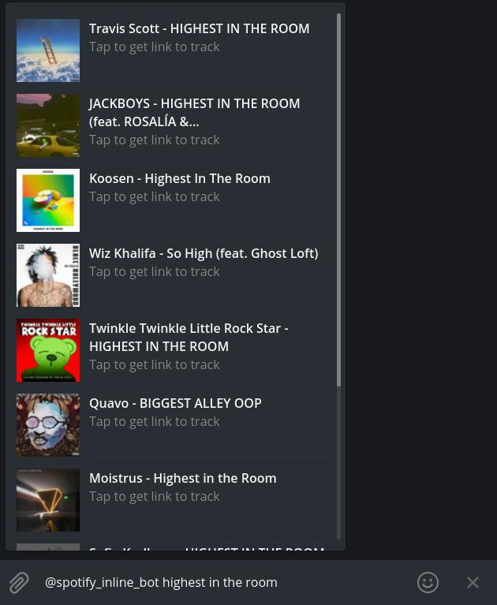

# SpotifyBot  
## Inline telegram bot to search and send tracks from Spotify directly in Telegram  
This bot can help you find and share music from Spotify.
It works automatically, no need to add it anywhere. 
Simply open any of your chats and type @spotify_inline_bot something in the message field.
  
Then tap on a result to send.    
You can search both by track and by artist  
  
Search tracks by artist  
  
Search tracks by track name

